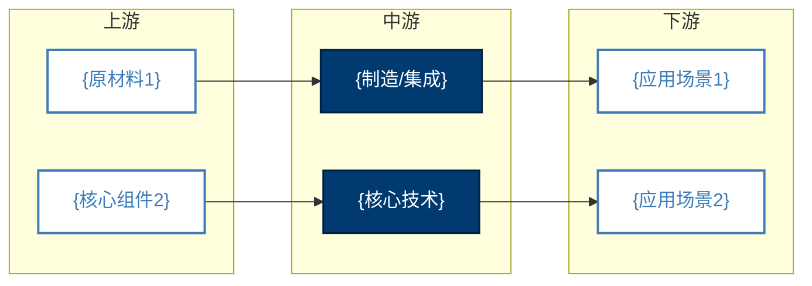
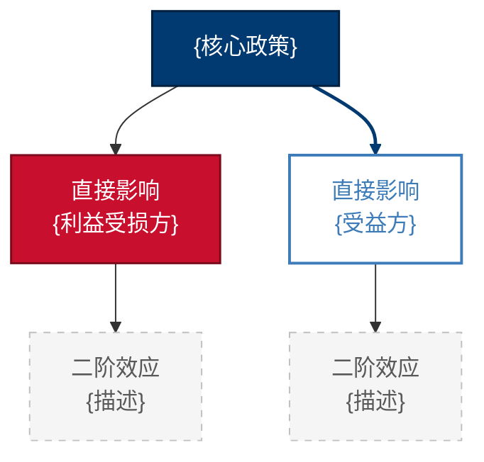
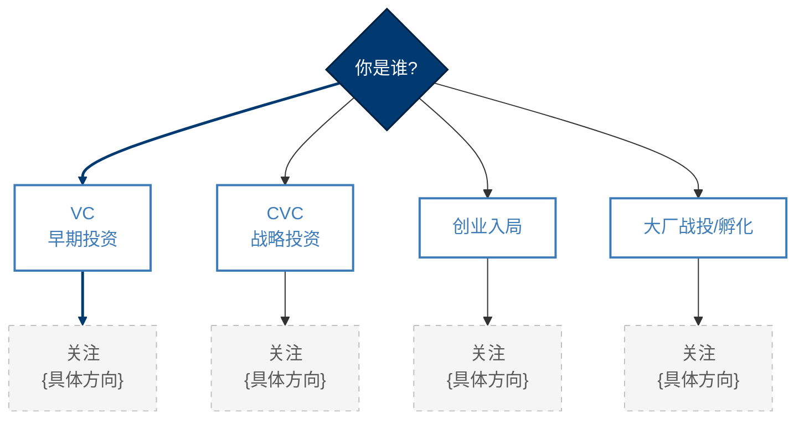

# 麦肯锡白皮书风格｜五大板块报告模板

本模板是 SKILL.md 阶段 5 写作的强制对照范式。每个板块都列出了**必备子小节**、**必备可视化元素**、**字数下限**、**写作要点**。所有 `{占位符}` 在写作时替换为实际数据。

> **年份占位符约定**：`{CURRENT_YEAR}` / `{LAST_YEAR}` / `{NEXT_YEAR}` / `{NEXT_2_YEARS}` 由 SKILL.md 阶段 0 的 `date +%Y` 解算填入；写报告时必须替换为实际年份（例如执行年=2026 → `{CURRENT_YEAR}`=2026、`{NEXT_YEAR}`=2027；执行年=2027 → `{CURRENT_YEAR}`=2027、`{NEXT_YEAR}`=2028）。模板中保留占位符仅为说明用途，最终交付报告中**禁止出现 `{CURRENT_YEAR}` 等花括号占位符**。

> **【标题注入铁律 / SINGLE-SOURCE-OF-TRUTH】**
> 报告中所有 `# 一级标题` 与 `## 二级板块标题` 由 `scripts/assemble_report.py` 在 `init` 阶段一次性写入，是**唯一权威来源**。
>
> 本模板仅描述每个板块"该写什么"，**不再重复列出该板块的 `## ` 二级标题**。写作 `_section_tmp.md` 时：
> - **禁止**写入 `# 报告标题` 与 `## 一、行业定义...` / `## 二、产业链...` / `## 五、商业化落地...` / `## 结语` 等任何 `## ` 二级标题
> - **只写** `### 1.1`、`### 1.2`...等三级及以下标题与正文内容
> - 违反将被 `assemble_report.py append` 命令拒绝（已加预检守卫）

## 目录

- [全局规范](#全局规范)
- [板块写作指引](#板块写作指引)
  - [执行摘要写作指引](#执行摘要写作指引)
  - [板块一写作指引｜行业定义与当年市场大局观](#板块一写作指引行业定义与当年市场大局观)
  - [板块二写作指引｜产业链图谱与核心玩家格局](#板块二写作指引产业链图谱与核心玩家格局)
  - [板块三写作指引｜核心驱动力与行业发展痛点](#板块三写作指引核心驱动力与行业发展痛点)
  - [板块四写作指引｜未来 1-2 年趋势预测与红利爆发点](#板块四写作指引未来-1-2-年趋势预测与红利爆发点)
  - [板块五写作指引｜商业化落地建议与避坑指南](#板块五写作指引商业化落地建议与避坑指南)
  - [结语写作指引](#结语写作指引)

---

## 全局规范

| 项 | 要求 |
|----|------|
| 总字数 | ≥ 6,000 字（高客单价垂直交付） |
| 引用格式 | 句末标点前 `[(来源)](深链URL)`，多源空格分隔；禁止首页 URL；禁止编号引用 |
| 段落长度 | 每段 100-1,000 字；每个二级小节 ≥2 段 |
| 时效基准 | `{CURRENT_YEAR}`（由阶段 0 解算）；早于 `{LAST_YEAR}` 的数据须 `[OUT-OF-WINDOW]` 或 `[HISTORICAL-CONTEXT]` 标注 |
| 加粗策略 | 仅加粗关键数字、关键判断、核心实体；禁止短距重复加粗同一实体 |
| 调性 | 麦肯锡式克制；禁用"颠覆"、"重塑"、"行业领先"、"赋能"、"全面升级" |
| 可视化 | 每板块 ≥1 个非纯文本元素（表格 / Mermaid / 图表 / LaTeX） |
| 置信度 | LOW 用对冲语言；HIGH 才允许直陈 |

> **关于报告骨架**：报告的一级标题、五大板块的二级标题（执行摘要 / 一、二、三、四、五 / 结语）以及证据底稿引用，均由 `assemble_report.py init` 一次性生成。本模板下方各"写作指引"章节**只描述每个板块的内容要求与三级子标题**，不重复列出二级标题。

---

## 板块写作指引

### 执行摘要写作指引

- **字数**：300-500 字
- **必备元素**：
  1. 1 句话核心判断（决策者可直接引用）
  2. 3-5 个关键数字（市场规模、CAGR、利润率、融资额等）
  3. 2-3 条核心趋势 bullet
  4. 1 条最大风险提示
- **禁忌**：禁止"本报告将探讨..."、"在本报告中我们..."等绕弯开场。
- **`_section_tmp.md` 起手范例**（注意：不写 `## 执行摘要`，标题由脚本注入）：

```markdown
（300-500 字）截至 `{CURRENT_YEAR}` H1，{行业} 全球市场规模达 **{X} 亿美元**[(来源)](url)，`{LAST_YEAR}` 至 `{CURRENT_YEAR+5}` CAGR 预计 **{Y}%**[(来源)](url)，处于成长期早段。本研究的核心判断是：**{一句话核心判断}**。结构性机会集中在产业链 {利润最厚的环节}，`{CURRENT_YEAR}`-`{NEXT_YEAR}` 红利爆发的触发条件是 {关键阈值}。最大不确定性来自 {风险点}，反转信号为 {可观察指标}。建议 {决策意图对应的核心动作}。
```

---

### 板块一写作指引｜行业定义与当年市场大局观

- **字数下限**：800 字
- **核心问题**：这是什么生意？盘子多大？长得多快？
- **必备三级小节**（按此顺序）：

#### 1.1 行业定义与边界

- 给出官方/学术定义 + 自定义研究边界（包含什么、排除什么）
- 行业生命周期定位（导入 / 成长 / 成熟 / 衰退）

**必备表格（行业边界对照表，见 visual_style_guide §6.1，废止 Mermaid 树状边界图）**：

```markdown
| 维度 | 包含范围 | 排除范围 | 边界依据 |
|------|---------|---------|---------|
| 产品形态 | {具体形态1}、{具体形态2} | {相邻形态}、{替代品} | [(来源)](url) |
| 应用场景 | {场景A}、{场景B} | {不归属此行业的场景} | [(来源)](url) |
| 价值链位置 | {环节} | {上下游邻接行业} | [(来源)](url) |
| 客户类型 | toB / toC / toG（择一或多） | {不在范围的客户类型} | 自定义研究边界 |
```

#### 1.2 当年市场规模（全球 vs 中国）

**必备表格（多源对照）**：

```markdown
| 口径 | 数据来源 | 全球规模(亿美元) | 中国规模(亿元) | 数据日期 | 置信度 |
|------|----------|-----------------|----------------|---------|--------|
| {机构A} | [(来源)](url) | {X} | {Y} | {CURRENT_YEAR}-MM | HIGH |
| {机构B} | [(来源)](url) | {X} | {Y} | {CURRENT_YEAR}-MM | HIGH |
| {机构C} | [(来源)](url) | {X} | {Y} | {LAST_YEAR}-MM | MEDIUM |
```

> **写作要点**：多源数据存在差异时不要做平均，必须解释差异原因（统计口径、含/不含 X 子市场等）。

#### 1.3 CAGR 与生命周期定位

- `{LAST_YEAR}` 至 `{CURRENT_YEAR+5}` CAGR 区间（多机构并列）
- LaTeX 公式说明（如复合增长率定义）：$\text{CAGR} = \left(\frac{V_{end}}{V_{start}}\right)^{1/n} - 1$

#### 1.4 关键里程碑事件回顾

时间轴 Mermaid 或表格，列出 `{LAST_YEAR-2}` 至 `{CURRENT_YEAR}` 行业关键事件（覆盖近 2-3 年的历史脉络）。

---

### 板块二写作指引｜产业链图谱与核心玩家格局

- **字数下限**：1,400 字（核心板块，"谁在赚大钱"）
- **核心问题**：利润分布在产业链哪一层？谁是赢家？

#### 2.1 产业链全景图谱

**必备 Mermaid（产业链图谱，主题与 classDef 详见 visual_style_guide §3）**：

````markdown

````

#### 2.2 各环节利润分配（核心：谁在赚大钱）

**必备表格**：

```markdown
| 环节 | 代表公司 | 毛利率区间 | 净利率区间 | 行业地位 | 议价能力 | 数据来源 |
|------|---------|-----------|-----------|---------|---------|---------|
| 上游-{X} | {公司} | {x%-y%} | {x%-y%} | CR3={z%} | 高/中/低 | [(来源)](url) |
| 中游-{X} | {公司} | {x%-y%} | {x%-y%} | CR3={z%} | 高/中/低 | [(来源)](url) |
| 下游-{X} | {公司} | {x%-y%} | {x%-y%} | CR3={z%} | 高/中/低 | [(来源)](url) |
```

**必备 Plotly 桑基图（标准生成代码见 visual_style_guide §4）**：

将产业链每个环节作为节点，连线粗细 = 毛利率 × 营收占比，从上游 → 中游 → 下游 → 利润池汇聚节点（高/中/低三档）。一张图同时呈现"利润流向"和"利润厚度"，决策表达力远高于饼图。

```python
import plotly.graph_objects as go

nodes = ["上游-{X1}", "上游-{X2}", "中游-{Y1}", "中游-{Y2}",
         "下游-{Z1}", "下游-{Z2}",
         "高利润池(>40%)", "中利润池(20-40%)", "低利润池(<20%)"]
node_colors = ["#3D7CB8", "#3D7CB8", "#003A70", "#003A70",
               "#595959", "#595959",
               "#2E7D32", "#3D7CB8", "#C8102E"]
links = dict(
    source=[0, 1, 2, 3, 4, 5, 2, 3],
    target=[2, 3, 4, 5, 6, 7, 6, 8],
    value=[30, 25, 35, 40, 60, 50, 45, 30],
    color=["rgba(61,124,184,0.4)"] * 8,
)
fig = go.Figure(data=[go.Sankey(
    arrangement="snap",
    node=dict(pad=20, thickness=22,
              line=dict(color="#001F3F", width=1),
              label=nodes, color=node_colors),
    link=links,
)])
fig.update_layout(
    title=dict(text=f"{行业} 产业链利润分配 ({CURRENT_YEAR})",
               font=dict(family="Helvetica, PingFang SC", size=16)),
    font=dict(family="Helvetica, PingFang SC", size=12, color="#222"),
    paper_bgcolor="white", width=900, height=560,
)
try:
    fig.write_image(f"{topic}_assets/产业链利润桑基图_{CURRENT_YEAR}.png", scale=2)
except Exception:
    fig.write_html(f"{topic}_assets/产业链利润桑基图_{CURRENT_YEAR}.html")
```

> **写作要点**：图前一段必须明确"链条粗细 = 毛利率 × 营收占比"避免误读；图后一段点出"利润最厚的环节是 {X}，对应代表公司是 {Y}，启示是 {Z}"。环境缺 plotly/kaleido 时退回 matplotlib 横向堆叠条形图（**禁止退回饼图**）。

#### 2.3 头部玩家阵营与定位

**必备表格（核心玩家对比）**：

```markdown
| 公司 | 业务定位 | 市占率 | 最新估值/市值 | PE/PS | 毛利率 | 最近一轮融资 | 关键差异化 |
|------|---------|--------|--------------|-------|--------|------------|-----------|
| {公司A} | {一句话} | {x%} [(来源)](url) | {Y} 亿美元 | {Z} | {w%} | {时间/金额/估值} | {核心壁垒} |
| {公司B} | ... | ... | ... | ... | ... | ... | ... |
```

写作时**只突出差异点**（产品定位、技术路线、客户结构），共性一笔带过。

#### 2.4 融资与估值热力图

- `{LAST_YEAR}`-`{CURRENT_YEAR}` 代表性融资事件（按金额降序前 5-10 个）
- 估值倍数区间（PE / PS / EV/EBITDA），与可比行业对照

---

### 板块三写作指引｜核心驱动力与行业发展痛点

- **字数下限**：1,200 字
- **核心问题**：为什么火？卡脖子在哪？

#### 3.1 五大核心驱动力

按 **技术 / 政策 / 需求 / 资本 / 供给侧** 五维分别展开，每维至少 1 段（≥100 字），每段需有具体数据/事件支撑。

**必备表格（驱动力 vs 痛点矩阵）**：

```markdown
| 维度 | 驱动力（推动） | 痛点（阻碍） | 净影响（H/M/L） |
|------|--------------|-------------|----------------|
| 技术 | {具体描述} [(来源)](url) | {具体描述} [(来源)](url) | H |
| 政策 | ... | ... | M |
| 需求 | ... | ... | H |
| 资本 | ... | ... | M |
| 供给 | ... | ... | L |
```

#### 3.2 卡脖子环节与技术瓶颈

针对硬科技/制造/新能源行业重点展开，必须列出：
- 卡脖子环节具体名称
- 主要供给方（国家、公司）
- 国产替代进度（用百分比量化）

#### 3.3 商业化瓶颈与单位经济挑战

- CAC、LTV、回本周期（行业平均 vs 头部）
- PMF 难找的具体表现

#### 3.4 政策与合规风险

**必备 Mermaid（因果链，主题与 classDef 详见 visual_style_guide §3）**：

````markdown

````

> **路径高亮**：`linkStyle X` 中 X 为推荐路径的连线索引（从 0 开始数），强调"主要因果链"，详见 visual_style_guide §7。

---

### 板块四写作指引｜未来 1-2 年趋势预测与红利爆发点

- **字数下限**：1,200 字
- **核心问题**：未来 1-2 年风口在哪？哪些信号要关注？
- **预测窗口**：`{CURRENT_YEAR}`-`{NEXT_YEAR}`（必要时延伸至 `{NEXT_2_YEARS}`）

#### 4.1-4.3 三大趋势（每个独立小节，≥300 字）

每个趋势写作模板：
1. 一句话趋势判断（粗体）
2. 数据 / 事件支撑（≥2 条具体证据）
3. 触发机制（为什么会这么演化）
4. 受益方与受损方
5. 时间表（预计何时发生）

#### 4.4 红利爆发的触发条件与领先指标

**必备表格**：

```markdown
| 趋势 | 触发条件（量化阈值） | 领先指标（如何观察） | 预计触发时点 | 受益方 | 受损方 |
|------|---------------------|---------------------|-------------|--------|--------|
| 趋势 1 | 单价降至 {X} 元 | {可观察指标 + 监测频率} | {CURRENT_YEAR} Q4 | {公司} | {公司} |
| 趋势 2 | 渗透率突破 {Y}% | ... | {NEXT_YEAR} H1 | ... | ... |
| 趋势 3 | 政策落地 {Z} 文件 | ... | {CURRENT_YEAR} H2 | ... | ... |
```

#### 4.5 反方观点与反转信号

**强制要求**：至少列出 2 条反方观点，注明出处。
- 反方 1：{论点}（出自 {人/机构}）→ 反驳要点：{...}
- 反方 2：{论点}（出自 {人/机构}）→ 反驳要点：{...}

**反转信号**：什么发生即说明本报告判断错误？至少 3 条可观察指标。

---

### 板块五写作指引｜商业化落地建议与避坑指南

- **字数下限**：1,000 字
- **核心问题**：怎么赚到钱？哪些坑必须避开？

#### 5.1 主流商业模式与单位经济

每种主流商业模式列出：定义、典型公司、CAC / LTV / 毛利率 / 回本周期、适用条件。

#### 5.2 决策者差异化路径（VC / CVC / 创业者 / 大厂战投）

**必备 Mermaid（决策树，主题与 classDef 详见 visual_style_guide §3）**：

````markdown

````

每个分支后接 1 段差异化建议（≥100 字），具体到该角色应该看什么、避开什么。

#### 5.3 进入壁垒与防御性

- 技术壁垒、品牌壁垒、规模壁垒、生态壁垒（每项一句话评级 + 论据）

#### 5.4 失败案例与避坑清单

**必备表格**（时间列填写实际年份，按照"近 2-3 年"窗口选案例）：

```markdown
| 失败/退出案例 | 公司 | 时间 | 失败原因 | 教训（避坑要点） | 来源 |
|--------------|------|------|---------|----------------|------|
| 案例 1 | {公司} | {YYYY} | {原因} | {具体怎么避} | [(来源)](url) |
| 案例 2 | {公司} | {YYYY} | ... | ... | ... |
| 案例 3 | {公司} | {YYYY} | ... | ... | ... |
```

至少 3 条具体避坑指南。

#### 5.5 90 天行动建议

按"立即（0-30 天）/ 近期（30-60 天）/ 中期（60-90 天）"三段，每段 2-3 条具体动作。

---

### 结语写作指引

- **字数**：200-400 字
- **必备元素**：
  1. **明确判断**：本报告核心结论的一句话总结
  2. **关键不确定性**：哪些假设若变化将颠覆结论？
  3. **下一步追踪建议**：3-5 个值得持续观察的指标 / 事件

- **`_section_tmp.md` 起手范例**（注意：不写 `## 结语`，标题由脚本注入）：

```markdown
（200-400 字）综上，{一句话核心判断} ...

**关键不确定性**：{若 X 假设不成立，结论将...}

**下一步追踪**：
1. {指标/事件 1}
2. {指标/事件 2}
3. {指标/事件 3}

> 本报告基于截至 {YYYY-MM-DD} 的公开信息，证据底稿见 `{topic}_evidence.md`。证据条数：{N}，HIGH 置信 {a} 条，MEDIUM {b} 条，LOW {c} 条。
```
