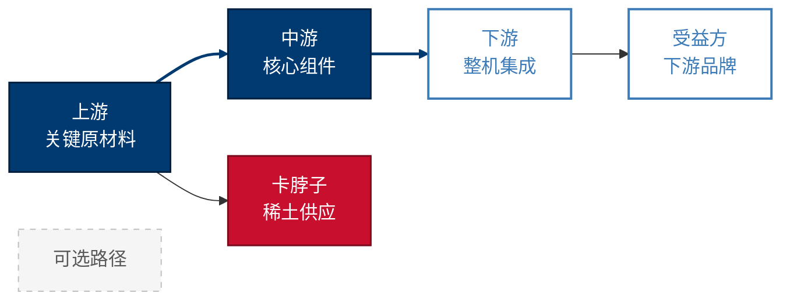

# 视觉风格规范｜麦肯锡蓝灰风

本文件是 SKILL.md 阶段 5 写作时**所有图表必须对照的视觉规范**。所有 Mermaid 块、IPython/Plotly 图表、表格高亮均须遵循本规范，任何偏离需在写作时显式说明理由。

> **v2 升级要点（请仔细阅读）**：
> 本版本对 Mermaid 主题做了**架构性升级**——把 `primaryColor` 改成**中性极浅灰**（不再是 `#003A70`），强迫每个节点必须显式挂载 classDef 才能着色，避免"忘挂 class 就默认深蓝"导致的视觉错乱。同时锁死了 `clusterBkg`（subgraph 背景），并新增了"长文本强制换行"和"linkStyle 高亮路径"两条工业级约束。

## 目录

- [1. 配色系统](#1-配色系统)
- [2. 字体](#2-字体)
- [3. Mermaid 主题模板（强制 v2）](#3-mermaid-主题模板强制-v2)
- [4. classDef 节点角色样式（强制 v2）](#4-classdef-节点角色样式强制-v2)
- [5. 长文本换行与节点约束（v2 新增）](#5-长文本换行与节点约束v2-新增)
- [6. linkStyle 推荐路径高亮（v2 新增）](#6-linkstyle-推荐路径高亮v2-新增)
- [7. Plotly 桑基图（板块二利润分配标准图）](#7-plotly-桑基图板块二利润分配标准图)
- [8. IPython matplotlib 兜底配色](#8-ipython-matplotlib-兜底配色)
- [9. 图与表的取舍](#9-图与表的取舍)
- [10. 各板块图表角色映射速查](#10-各板块图表角色映射速查)

---

## 1. 配色系统

| 用途 | 色值 | 备注 |
|------|------|------|
| 主色（McKinsey Deep Blue） | `#003A70` | 用于 classDef primary 节点、关键标题、关键数字加粗 |
| 强调色（朱红） | `#C8102E` | 仅用于关键风险、卡脖子、负面结论；用量克制（一图最多 2 个朱红节点） |
| 辅色 1（钢蓝） | `#3D7CB8` | classDef secondary/positive 描边与文字色 |
| 辅色 2（暖灰） | `#718096` | 连线与一般文字 |
| 极浅灰背景 | `#F8F9FA` | **新版默认节点底**、subgraph 背景、表格隔行底 |
| 浅灰边框 | `#E2E8F0` / `#D9D9D9` | subgraph 边框、未挂 class 节点边框 |
| 暖灰中性边框 | `#BFBFBF` | classDef neutral 虚线边框 |
| 文字深灰 | `#2D3748` | 浅底节点的文字色（替代纯黑，质感更柔） |
| 边框深蓝 | `#001F3F` | classDef primary 节点的深色描边 |

> **禁止**：彩虹配色、霓虹色、>5 种颜色同图。一张图主色 + 强调 + 辅色不超过 4 色。

## 2. 字体

- 中文：`PingFang SC`（macOS/iOS 苹方） / `Noto Sans CJK SC`（Linux 兜底）
- 英文：`Helvetica` / `Helvetica Neue` / `Arial`
- **不使用 `Microsoft YaHei`**：会导致 Mac/Windows 渲染差异
- 字号：节点 14px、连线/边标签 12px、标题 16px

## 3. Mermaid 主题模板（强制 v2）

**每个 Mermaid 代码块必须以以下 init 块开头**，否则 `assemble_report.py validate` 会告警。

````markdown
```mermaid
%%{init: {
  'theme': 'base',
  'themeVariables': {
    'background': '#FFFFFF',
    'primaryColor': '#F8F9FA',
    'primaryTextColor': '#2D3748',
    'primaryBorderColor': '#D9D9D9',
    'lineColor': '#718096',
    'edgeLabelBackground': '#FFFFFF',
    'fontFamily': 'Helvetica, "Helvetica Neue", "PingFang SC", "Noto Sans CJK SC", sans-serif',
    'fontSize': '14px',
    'clusterBkg': '#F8F9FA',
    'clusterBorder': '#E2E8F0'
  }
}}%%
graph LR
    %% ...nodes & classDef
```
````

### 3.1 关键字段说明（不要随意改）

| 字段 | 作用 | 为什么这样设 |
|------|------|------------|
| `primaryColor: #F8F9FA` | **未挂 class 节点的默认底色** | 设为极浅灰，强迫所有需要颜色语义的节点显式挂 class；忘挂 class 也只是看到中性灰，不会"碰巧深蓝" |
| `primaryTextColor: #2D3748` | 默认节点文字色 | 浅底深字，比纯黑柔和 |
| `clusterBkg: #F8F9FA` | **subgraph 背景** | Mermaid 默认子图底色饱和度高且丑（浅紫），必须锁死 |
| `clusterBorder: #E2E8F0` | subgraph 边框 | 与背景同色系，避免视觉割裂 |
| `edgeLabelBackground: #FFFFFF` | 连线标签的白色描边 | 防止连线标签与连线本身视觉粘连 |
| `lineColor: #718096` | 连线颜色 | 中灰，让节点成为视觉重心 |

> **不写 `fontSize` 之外的字号变量**：Mermaid 没有官方 `tagFontSize`/`edgeFontSize` 变量。如确需精控连线标签字号，使用 `themeCSS`，见 §3.2。

### 3.2 [可选] 用 themeCSS 精控连线标签字号

仅在连线标签明显过大时启用：

````markdown
```mermaid
%%{init: {
  'theme': 'base',
  'themeVariables': { ... 同上 ... },
  'themeCSS': '.edgeLabel { font-size: 12px; background: #FFFFFF; padding: 2px 4px; }'
}}%%
```
````

## 4. classDef 节点角色样式（强制 v2）

每张图必须在末尾追加以下 classDef 块，并用 `:::primary` / `:::secondary` / `:::danger` / `:::positive` / `:::neutral` 显式挂载到节点。

```
%% 1. primary（核心节点 / 政策本体 / 主体玩家）：深蓝底 + 白字，最高视觉权重
classDef primary fill:#003A70,stroke:#001F3F,stroke-width:1.5px,color:#FFFFFF;

%% 2. secondary（次要并列玩家 / 受益方）：白底 + 钢蓝框 + 钢蓝字，"实心—描边"对照拉开层次
classDef secondary fill:#FFFFFF,stroke:#3D7CB8,stroke-width:2px,color:#3D7CB8;

%% 3. positive（政策受益方 / 正向受益）：与 secondary 同款描边样式（语义可单独标注）
classDef positive fill:#FFFFFF,stroke:#3D7CB8,stroke-width:2px,color:#3D7CB8;

%% 4. danger（风险 / 卡脖子 / 利润高地 / 政策受损方）：朱红底 + 白字，绝对警示
classDef danger fill:#C8102E,stroke:#7A0A1C,stroke-width:1.5px,color:#FFFFFF;

%% 5. neutral（不推荐路径 / 一般背景 / 次要选项）：浅灰底 + 暗灰字 + 虚线框，降低视觉噪音
classDef neutral fill:#F5F5F5,stroke:#BFBFBF,stroke-width:1px,color:#595959,stroke-dasharray: 5 5;
```

> **secondary 与 positive 写两份的原因**：CSS 上完全一致，但语义不同（一个表达"次要主流玩家"，一个表达"政策受益方"）。语义留两份便于阅读 mermaid 源码时自解释；如果你希望强 DRY，可以只保留 secondary 一个 class，positive 节点直接挂 `:::secondary` 也合规。

### 4.1 完整图样例（含 v2 主题 + classDef + 长文本换行 + 路径高亮）

````markdown

````

## 5. 长文本换行与节点约束（v2 新增）

**Mermaid 不会自动换行**——节点文字过长会把方框撑成长条，整张图的拓扑布局崩溃。**强制规则**：

| 节点文字长度 | 处理方式 |
|------------|---------|
| ≤ 8 个汉字 / 16 个西文字符 | 单行直写：`A[节点名]` |
| 9-16 个汉字 / 17-32 个西文字符 | 双引号包裹 + `<br/>` 强制换行：`A["第一行<br/>第二行"]` |
| > 16 个汉字 | 抽象成短标题（≤ 8 字） + 在节点下方文字段说明全称；或拆成两个节点 |

写作时机器规则：

```
反例（爆框）：
A[板块二：产业链上游核心关键原材料及稀土高地供应商]

正例：
A["上游核心原材料<br/>稀土供应商"]:::primary
```

**单图节点数仍限制 ≤ 7**（Miller's Rule）。超过 7 个节点必须：① 拆为两张图；或 ② 改用桑基图 / 表格。

## 6. linkStyle 推荐路径高亮（v2 新增）

麦肯锡 Slide 的精髓之一是"**顺着一根粗箭头看核心结论**"。在决策树（板块五）和因果链（板块三）中，**必须**用 `linkStyle` 把推荐路径或核心因果链加粗高亮：

```
%% 默认连线灰色细线（已由主题 lineColor 设定）
%% 推荐路径 / 核心因果用麦肯锡深蓝加粗
linkStyle 0 stroke:#003A70,stroke-width:2.5px;
linkStyle 1 stroke:#003A70,stroke-width:2.5px;

%% 警示连线（受损方因果）用朱红
linkStyle 5 stroke:#C8102E,stroke-width:2px,stroke-dasharray: 5 5;
```

**`linkStyle` 索引规则**：按 mermaid 源码中**连线声明顺序**从 0 开始计数。第一条 `A --> B` 是 0，第二条是 1，依此类推。

各板块强制要求：

| 板块 | 必须高亮的连线 | 颜色 |
|------|--------------|------|
| 板块三 政策因果链 | 政策→核心受益方主链 | `#003A70`，2.5px |
| 板块三 政策因果链 | 政策→核心受损方主链 | `#C8102E`，2px，虚线 |
| 板块五 决策树 | 推荐决策路径全链路 | `#003A70`，2.5px |

## 7. Plotly 桑基图（板块二利润分配标准图）

**板块二利润分配从饼图升级为桑基图**——一张图同时呈现产业链流向（左→右）与利润厚度（链条粗细），决策表达力远高于饼图。

### 7.1 标准生成代码

```python
import plotly.graph_objects as go
import plotly.io as pio

# 节点：上游环节 + 中游环节 + 下游环节 + "利润池"汇聚节点
nodes = [
    # 上游
    "上游-{X1}", "上游-{X2}",
    # 中游
    "中游-{Y1}", "中游-{Y2}",
    # 下游
    "下游-{Z1}", "下游-{Z2}",
    # 利润池（终汇点，按毛利率厚度展示）
    "高利润池(>40%)", "中利润池(20-40%)", "低利润池(<20%)",
]

# 颜色：上游钢蓝、中游深蓝、下游灰、利润池按厚度梯度
node_colors = [
    "#3D7CB8", "#3D7CB8",
    "#003A70", "#003A70",
    "#718096", "#718096",
    "#003A70", "#3D7CB8", "#C8102E",
]

# 链：source -> target，value 用毛利率或营收乘数表达粗细
links = dict(
    source=[0, 1, 2, 3, 4, 5, 2, 3],   # 节点索引
    target=[2, 3, 4, 5, 6, 7, 6, 8],
    value=[30, 25, 35, 40, 60, 50, 45, 30],
    color=["rgba(61,124,184,0.4)"] * 8,
)

fig = go.Figure(data=[go.Sankey(
    arrangement="snap",
    node=dict(
        pad=20, thickness=22,
        line=dict(color="#001F3F", width=1),
        label=nodes, color=node_colors,
    ),
    link=links,
)])
fig.update_layout(
    title=dict(text=f"{行业} 产业链利润分配桑基图 ({CURRENT_YEAR})",
               font=dict(family="Helvetica, PingFang SC", size=16)),
    font=dict(family="Helvetica, PingFang SC", size=12, color="#2D3748"),
    paper_bgcolor="white",
    width=900, height=560,
)
# 输出 PNG（需 kaleido）；若环境无 kaleido，回退 HTML
try:
    fig.write_image(f"{topic}_assets/产业链利润桑基图_{CURRENT_YEAR}.png", scale=2)
except Exception:
    fig.write_html(f"{topic}_assets/产业链利润桑基图_{CURRENT_YEAR}.html")
```

### 7.2 写作要点

- **链宽含义必须显式说明**：在桑基图前一段写清"链条粗细 = 毛利率 × 营收占比"或"链条粗细 = 营收流量"，避免读者误读。
- **节点数量控制**：左 + 中 + 右共不超过 12 个节点，否则视觉拥挤。
- **降级路径**：环境缺 plotly/kaleido 时，回退到 matplotlib 横向堆叠条形图（不再使用饼图）。

## 8. IPython matplotlib 兜底配色

如必须使用 matplotlib（如趋势线、分布图），统一使用以下色板，禁用默认 tab10：

```python
MCK_PALETTE = ["#003A70", "#3D7CB8", "#C8102E", "#718096", "#D9D9D9", "#2D3748"]
import matplotlib
matplotlib.rcParams["font.sans-serif"] = ["Helvetica", "PingFang SC", "Noto Sans CJK SC"]
matplotlib.rcParams["axes.unicode_minus"] = False
matplotlib.rcParams["axes.prop_cycle"] = matplotlib.cycler(color=MCK_PALETTE)
```

图表必须包含：
- 标题（16px，加粗）
- 轴标签（12px）
- 数据来源水印（右下角小字 8-10px："Source: {机构} ({CURRENT_YEAR})"）

## 9. 图与表的取舍

| 表达内容 | 推荐形式 | 禁用形式 |
|---------|---------|---------|
| "包含 / 排除" 二分边界 | **表格**（两列对照），克制专业 | Mermaid 树（过度设计） |
| 上下游层级关系 | Mermaid `graph LR` 主题化 v2 | 纯文字罗列 |
| 利润流向 + 厚度 | Plotly 桑基图 | 饼图（信息密度低） |
| 多实体多属性对比 | Markdown 表格 | Mermaid 表格 |
| 政策/技术因果链 | Mermaid `graph TD` 主题化 v2 + linkStyle 高亮 | 纯文字 |
| 决策分支 | Mermaid `graph TD` 决策树 + linkStyle 高亮推荐路径 | 嵌套列表 |
| 时间序列趋势 | matplotlib 折线图（用 MCK_PALETTE） | Mermaid timeline（兼容性差） |

### 9.1 板块一 行业边界标准表格

```markdown
| 维度 | 包含范围 | 排除范围 | 边界依据 |
|------|---------|---------|---------|
| 产品形态 | {具体形态1}、{具体形态2} | {相邻形态}、{替代品} | [(来源)](url) |
| 应用场景 | {场景A}、{场景B} | {不归属此行业的场景} | [(来源)](url) |
| 价值链位置 | {环节} | {上下游邻接行业} | [(来源)](url) |
| 客户类型 | toB / toC / toG（择一或多） | {不在范围的客户类型} | 自定义研究边界 |
```

## 10. 各板块图表角色映射速查

| 板块 | 图类型 | 主要 classDef 用法 | 必须的 v2 升级动作 |
|------|--------|------------------|------------------|
| 板块二 产业链图谱 | `graph LR` 三层 subgraph | 主流玩家 primary、并列玩家 secondary、卡脖子环节 danger | subgraph 已自动锁死浅灰背景；玩家节点必须挂 class |
| 板块二 利润分配 | Plotly 桑基图 | （Plotly 自身配色，遵循 §7.1） | 严禁饼图 |
| 板块三 政策因果链 | `graph TD` | 政策本体 primary、受益 positive、受损 danger | linkStyle 主链路加粗 |
| 板块五 决策树 | `graph TD` | 根问 primary、推荐路径 secondary、不推荐 neutral | linkStyle 推荐路径全链路加粗深蓝 |

> **板块一原"行业边界 Mermaid 图"已废止**，改为 [板块一边界表格](#91-板块一-行业边界标准表格) 范式。
